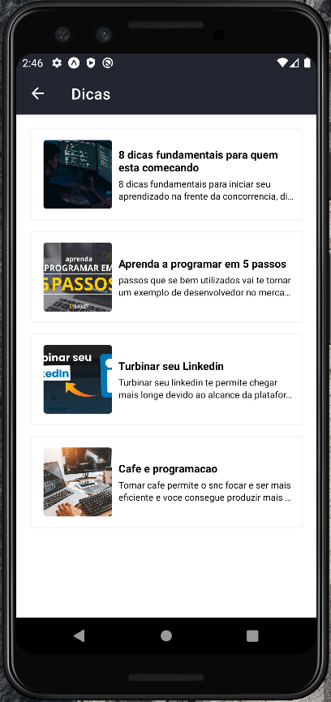
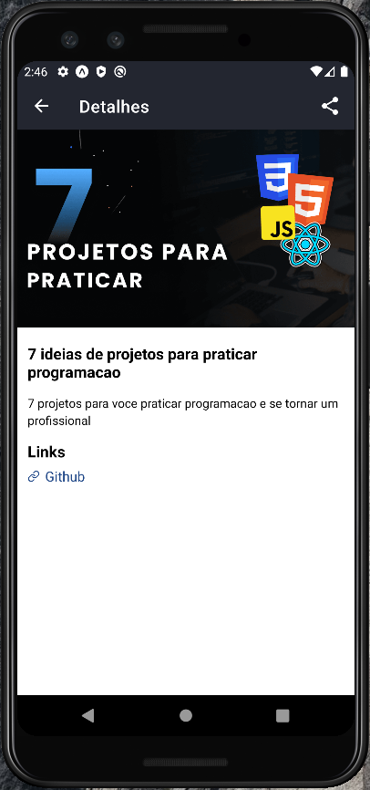
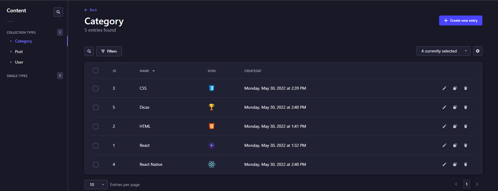
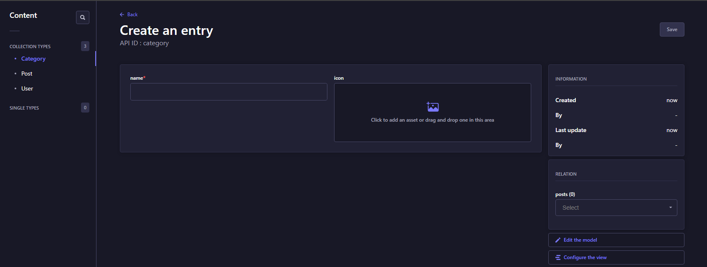

# BLOG

# Sobre o projeto

Aplicação mobile de um blog que lista artigos sobre tecnologia e dicas. 

### Explicação do sistema

#### Aplicativo

- Na página principal é listado varios cards com as categorias

- Quando uma categoria for favoritada é listado os artigos sobre a mesma na tela principal

- Na parte principal do conteúdo é listado os ultimos artigos postados

#### CMS

- Para cadastrar artigos ou categorias é necessario logar no administrador do strapi para enviar os arquivos 

### Inicio sem favorito


### Inicio com favorito 


### Categoria selecionada


### Artigo selecionado


### Navegador aberto dentro do aplicativo


### Listando as categorias no strapi


### Inserindo nova categoria no strapi


# 🚀 Começando

Essas instruções permitirão que você obtenha uma cópia do projeto em operação na sua máquina local para fins de desenvolvimento e teste.

## 📋 Pré-requisitos

- npm / yarn
- virtual device ou aplicativo expo no smartphone

## 🔧 Instalação
### :warning::warning: **A pasta imgs**: é para guardar as imagens usadas no readme.md! Apagar ela depois do clone :warning::warning:

``` bash
## clonar repositório
git clone https://github.com/PauloCSantos/blog-reactnative.git

# no diretório blog

## entrar na pasta do blog no terminal
cd blog

## instalar as dependencias
expo install

## executar o projeto
expo start

## executar no app expo 
abrir o expo no celular e ler o qrcode

## executar no emulador
pressiona a para abrir no android

# no diretório blog-api

## entrar na pasta do blog-api no terminal
cd blog

## instalar as dependencias
npm install

## executar o projeto
npm start

## Acessar o endereço que aparece no terminal
- Acessar o endereço no terminal
- Fazer o cadastro no strapi
- Localizar o Content
- Criar entry nas coleções Category e Post

## Diretorio imgs-api
O arquivo ZIP contem imagens para usar no strapi de exemplo
```

## 🛠️ Construído com

- Expo
- React Native
- Axios
- React Native animatable
- React Native stack
- Strapi

## ✒️ Autor

* **Paulo C Santos** - [Linkedin](https://www.linkedin.com/in/paulocsantos1995/)

## 🖐️ Agradecimento

Agradeço ao sujeito programador. O workshop foi excelente e o aplicativo construido permitiu ampliar meus conhecimentos em react native 
e conhecer novas funcionalidades.

- Link do site do Sujeito Programador: https://sujeitoprogramador.com/
